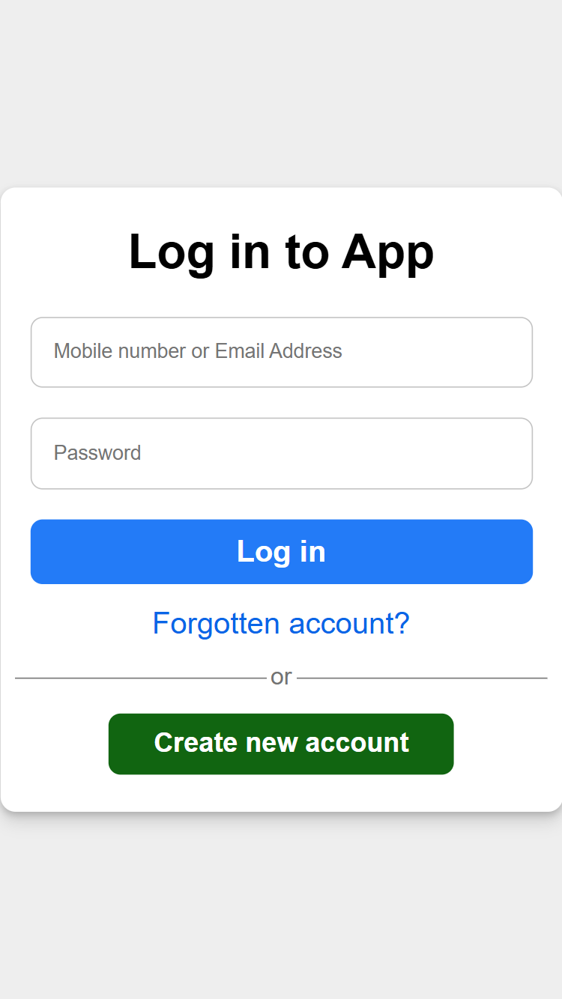
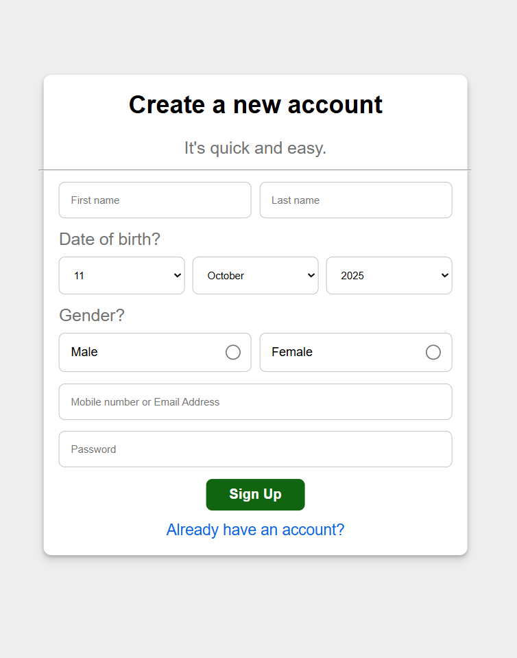
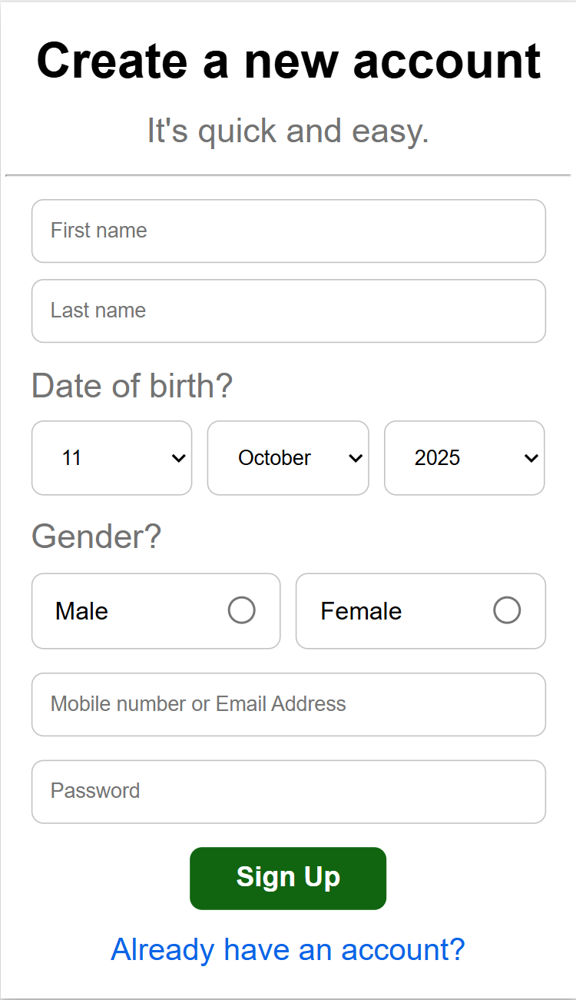
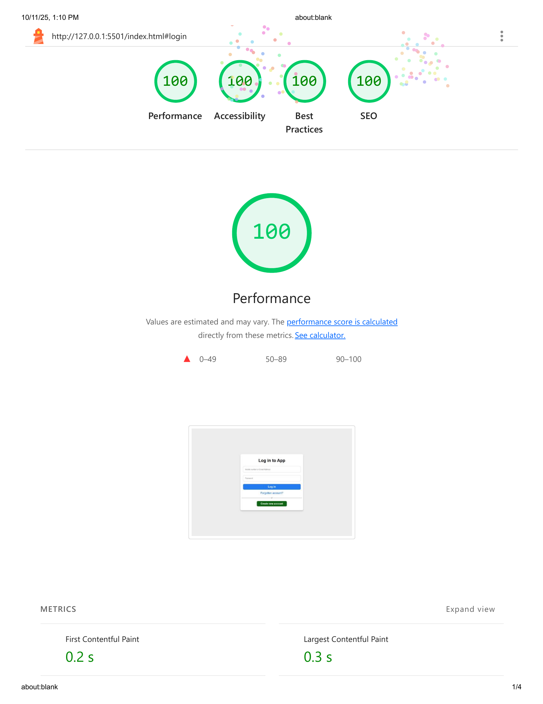

# 🧾 Smart Registration & Login Form

A responsive and interactive form validation web app built using **HTML**, **CSS**, and **JavaScript**.  
This project includes advanced input validation, password strength indicators, and user data persistence using **Local Storage**.

---

🚀 Live Demo

👉 [https://github.com/ahmednabil22224/form-validation-app](https://ahmednabil22224.github.io/form-validation-app/)

---

## 🚀 Features

✅ **Register & Login System**  
Create a new account or log in with saved credentials using local storage.

✅ **Real-Time Validation**  
Each field is validated as the user types, with clear error messages.

✅ **Password Strength Indicator**  
Password text changes color based on strength requirements (red → green).

✅ **Custom Error Messages**  
Uses CSS pseudo-elements (`::before`) to display error hints dynamically from JavaScript.

✅ **Responsive Design**  
Fully optimized for desktop, tablet, and mobile devices.

✅ **Local Storage Integration**  
Stores and retrieves user data locally (no backend needed).

---

## 🧠 Technologies Used

- **HTML5** – Structure
- **CSS3** – Styling and responsive layout
- **JavaScript (Vanilla)** – Logic and validation
- **Local Storage API** – Data persistence

---

```
## 🧩 Folder Structure

form-validation-app/
│
├── index.html
├── css/
│ └── style.css
├── js/
│ └── main.js
├── images/
│ ├── preview-login-desktop.png
│ ├── preview-login-mobile.png
│ └── preview-register-desktop.png
│ └── preview-register-mobile.png
└── README.md
```

---

## 📸 Screenshots

### 🖥️ Desktop


### 📱 Mobile



### 🖥️ Desktop



### 📱 Mobile

## 

## 🚀 How to Run Locally

1. Clone this repository:

   ```bash
   git clone https://github.com/ahmednabil22224/form-validation-app.git

   ```

2. Navigate to the project folder:

   cd form-validation-app

3.⚠️ Important:

This app uses JavaScript features like localStorage and URL hash routing.
It will not work correctly if opened directly from the file system (e.g., by double-clicking index.html).

You must run it through a local development server.

4.Start a local server:

. If you have VS Code, use the Live Server extension and click “Go Live”.

. Or, use one of these commands from the project folder:

      # Option 1: Using Python (built-in server)
      python -m http.server 5500

      # Option 2: Using Node.js
      npx serve

5.Open in browser:
http://localhost:5500

---

## 🌟 Lighthouse Report

| Metric            | Score |
| ----------------- | ----- |
| ⚡ Performance    | 100%  |
| ♿ Accessibility  | 100%  |
| 🛡️ Best Practices | 100%  |
| 🔍 SEO            | 100%  |

images/lighthouse-report.png

## ⚡ Lighthouse Report



---

🧩 Key Functions

. isValidPassword(password) → Checks lowercase, uppercase, digits, symbols, and length.

. isValidEmailOrEmail(username) → Validates email or 7-digit phone numbers.

. colorRequireFields() → Highlights empty fields with red borders.

. handlePwdColor(input) → Dynamically changes password input color based on strength.

---
